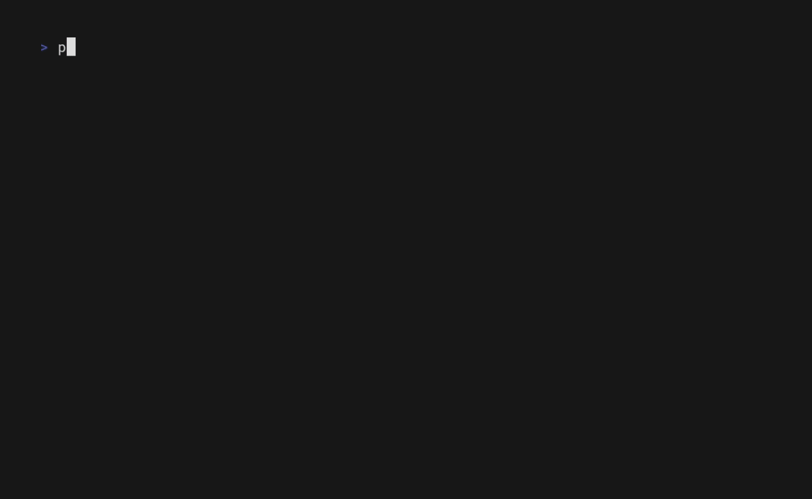

# What is this?

is a small neovim extension that uses telescope to change or open a tmux session using [phoemux](https://github.com/jhonnyV-V/phoemux)

currently it only works correctly if you use neovim inside a tmux extension

    

## How to Install?

using lazy
```lua
return {
	'jhonnyV-V/phoemux-telescope',
	dependencies = {
		'nvim-telescope/telescope.nvim',
	},
	lazy = true, --this plugin can be lazy loaded
	keys = {
		{
            --Choose your own keymap
			'<leader>ms',
			function()
				require('phoemux-telescope').phoemux()
			end,
			desc = 'Phoemux: open phoemux list'
		},
	},
}
```
